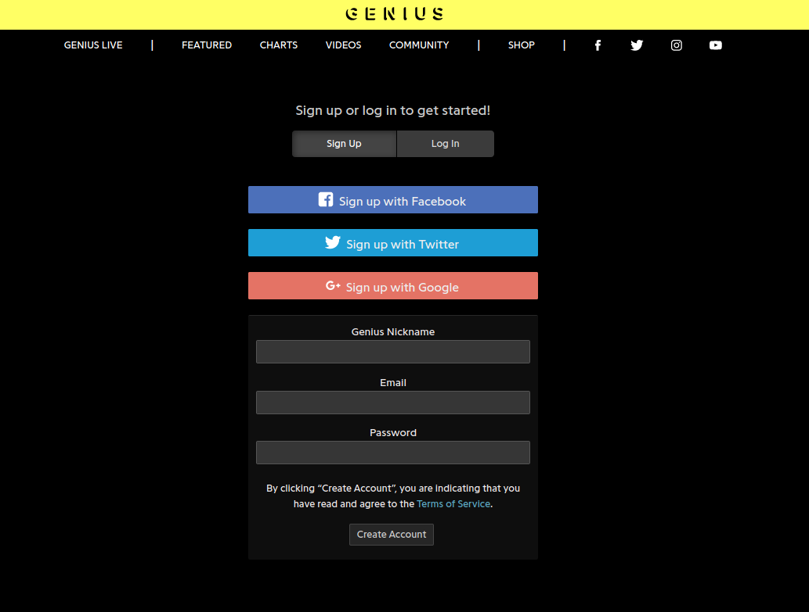
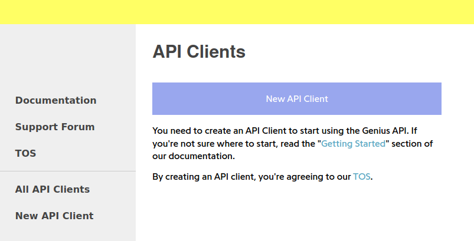
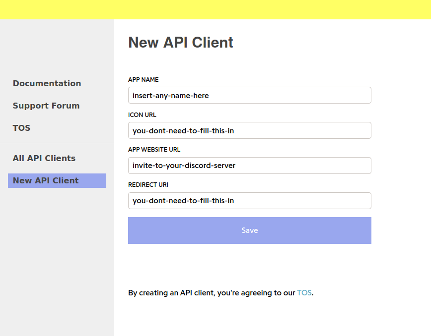
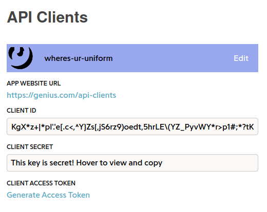

# Lyric Cloud
Discord bot that automatically creates wordclouds based off the lyrics of songs

**NOTE:** ONLY SUPPORTS ENGLISH

## Getting Started
Get an API Key From Genius
### How To Get An API Key From Genius
- Make your way to https://genius.com/signup_or_login and make an account

- Go on https://genius.com/api-clients and click "New API Client"

- Enter your App Name (can be anything) and your App Website URL. I would recommend making your App Website URL an invite to your discord server. But it can be any functioning URL

- Click "Generate Access Token"

- Copy the token that you're given
- Enter `-lyriccloud verify [Your API Key Here]` in the server that you would like to configure Lyric Cloud

## Commands
More information on how to verify an API key
`-lyriccloud how_to_verify`

Verify an API key
`-lyriccloud verify [API KEY]`

Search a song to be generated to a wordcloud
`-lyriccloud generate [SONG NAME]`

## TODO
- Add more language support
